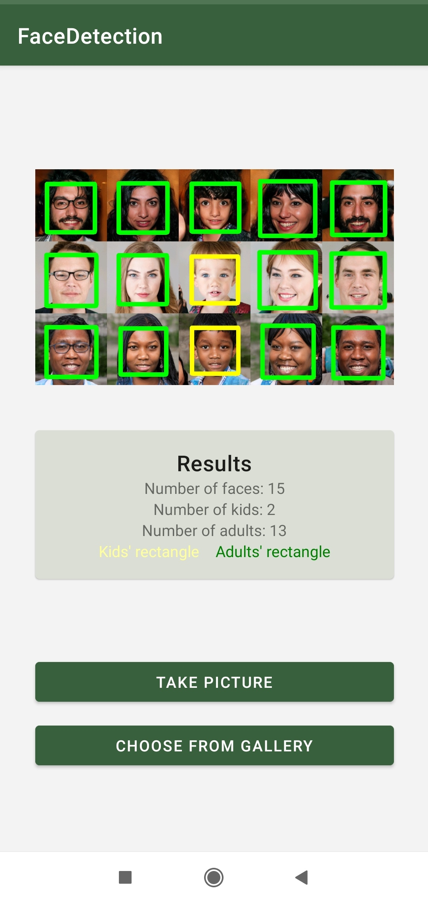
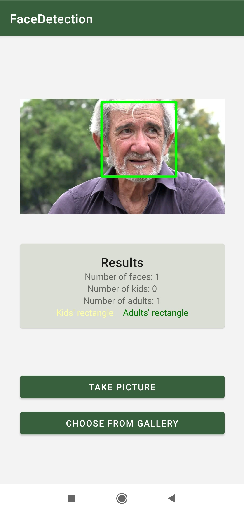
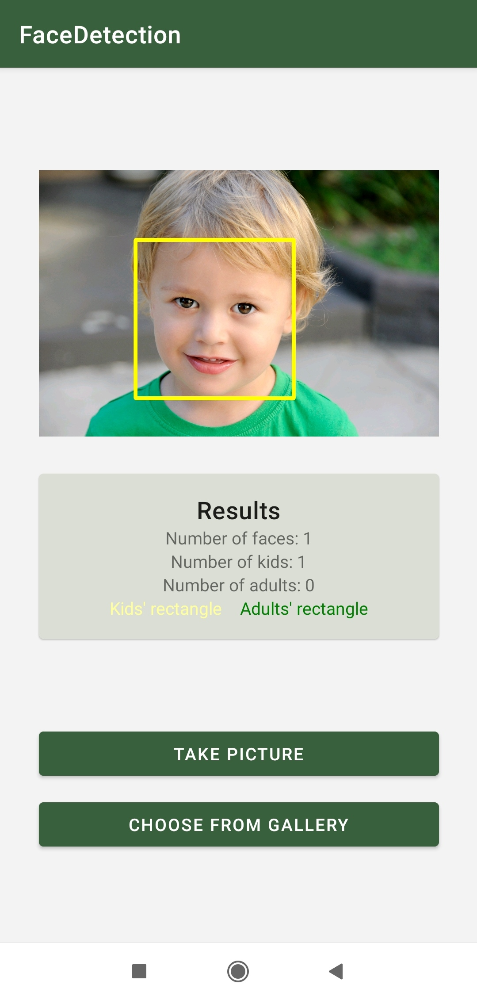

# Face Detection
## Table of contents
* [Features](#features)
* [Screenshots](#screenshots)
* [Installation](#installation)

## Features
FaceDetection is an Android app which allows users to detect faces from images. This app:
* Detects multiple faces from photos taken with camera or chosen from gallery
* Displays number of detected faces
* Displays number of kids and adults from given picture
* Draws rectangles around detected faces (yellow rectangle for kids and green for adults)

## Screenshots
<table>
  <tr>
    <td> Detection of multiple people </td>
     <td> Detection of single adult person </td>
     <td> Detection of single child </td>
  </tr>
  <tr>
    <td></td>
    <td></td>
    <td></td>
  </tr>
 </table>

## Installation 
Clone this repository and import into Android Studio
```
git clone https://github.com/cosidwo/FaceDetection.git
```
